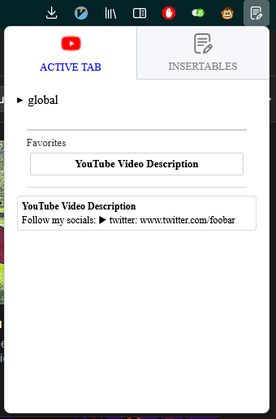
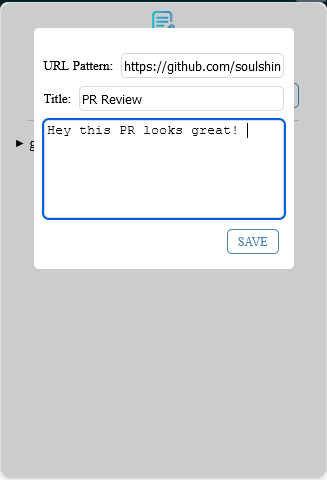
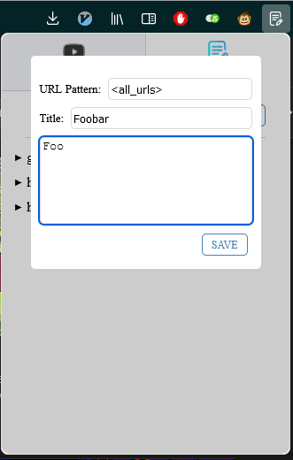
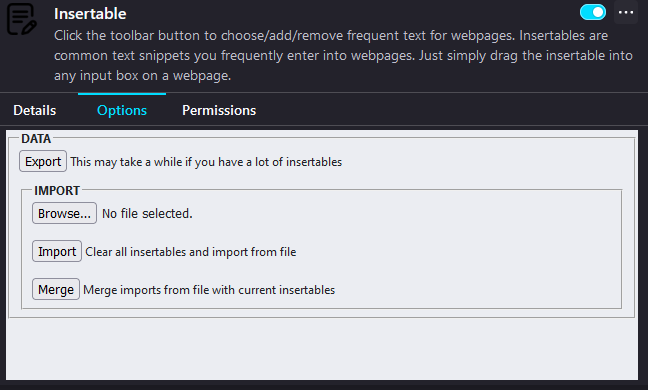

# Insertables

Insertables is a firefox extension text manager that allows for you to save text inserts for a specific website for quickly dragging and dropping them on any `<input>` or compatible element in your active browser tab.

Simply add an insertable, specify the url you want it to apply to and any time after that, simply drag it and drop it into the website wherever there is a compatible element.

## Features

- Active Tab Awareness
    - Anytime you save an insert for a specific webpage, and that exact url is your active tab, a special 'tab' is shown in the Insertable popup which contains only inserts for that webpage!
- Global insertables that apply to every page. Globals are always at the top of each Insertable tab
- Favorite frequently used insertables for a specific website
- Import your insertables to another device
- Export your insertables for backup

## FAQ

    
How to add a 'global' insertable

- To add a global insertable, click on the 'Add' button
- In the URL input, type `<all_urls>`
- Add your title and body
- Click save

    
How do you copy paste the text?

As of right now, this is not a limitation of the extension, rather it's not yet supported by the firefox extension api. Copy paste currently only supports image data

    
How to export

- Right click on the extension icon in your toolbar and select 'Manage extension'
- Click on the 'Options' tab
- Click the export button to backup your insertables

    
How to Import

- Right click on the extension icon in your toolbar and select 'Manage extension'
- Click on the 'Options' tab
- Click the 'Browse...' button to import a previously exported catalog
    - You can do a clean 'import' which deletes all your current insertables and imports the one from the file
    - You can do a merge import which DOES NOT delete your current insertables and merges them with the file

